# Assignment 11 -- optimizer internals

This directory holds the assignment work on top of Chintana, a modular,
multi-file refactor of [nanoGPT](https://github.com/karpathy/nanoGPT) (see
the repo root `README.md`/`CLAUDE.md` for the base project). This directory
is entirely additive: nothing here is imported by `train.py`, `sample.py`,
`bench.py`, or `chintana/`, so the base model and training pipeline behave
exactly as before except for the one deliberate change described below.

## Base-model change: Adam optimizer

`chintana/gpt.py`'s `GPT.configure_optimizers` builds a `torch.optim.Adam`.
This was requested specifically so the "real" optimizer used by actual
training runs is the same algorithm reproduced by hand in Q1 below.

Note for anyone setting `optim.weight_decay != 0` in a config (e.g. the
default `0.1` inherited by `config/train_shakespeare_char.yaml`):
`torch.optim.Adam`'s `weight_decay` is added directly into the gradient
before the moment updates (L2-style regularization), so it interacts with
the per-parameter adaptive learning rate rather than being applied as a
plain multiplicative shrink of the weight after the step. Everything else
(param grouping by tensor dimension, fused-kernel selection, betas) is
unchanged.

Verified: `train.py` still runs end-to-end
(`uv run python train.py config/train_shakespeare_char.yaml system.device=cpu system.compile=false`),
printing `using fused Adam: False`, with training proceeding normally.

## Q1 -- reproduce Adam by hand

Files:
- `manual_adam.py` -- a dependency-free, pure-Python reimplementation of the
  Adam update (`AdamState.step`), operating on plain floats.
- `q1_adam_by_hand.py` -- runs one synthetic weight through 5 fixed gradients,
  once through `manual_adam.AdamState`, once through `torch.optim.Adam`
  (float64, gradients set by hand via `w.grad = ...` -- no autograd involved),
  and checks every intermediate quantity against each other.
- `plotting.py` -- a small shared `plot_series` helper used by this and future
  questions.

Run it:
```bash
uv run python experiments/assignment11/q1_adam_by_hand.py
```

Setup: `w0 = 1.0`, `grads = [0.5, -0.3, 0.8, -0.1, 0.4]`, `lr = 1e-3`,
`beta1 = 0.9`, `beta2 = 0.999`, `eps = 1e-8` (Adam's textbook defaults).

Result: for every one of the 5 steps, the manually computed `m`, `v`, and
resulting weight `w` matched `torch.optim.Adam`'s internal state
(`opt.state[w]['exp_avg']`, `['exp_avg_sq']`) and output exactly, to
float64 precision (`max |w_manual - w_torch| = 0.00e+00` across all 5 steps --
see `results/logs/q1_adam_by_hand.csv` for the full per-step table).

| step | grad | m | v | m_hat | v_hat | update | w |
|---|---|---|---|---|---|---|---|
| 1 | 0.50 | 0.05000000 | 0.00025000 | 0.50000000 | 0.25000000 | 0.00100000 | 0.99900000 |
| 2 | -0.30 | 0.01500000 | 0.00033975 | 0.07894737 | 0.16995998 | 0.00019150 | 0.99880850 |
| 3 | 0.80 | 0.09350000 | 0.00097941 | 0.34501845 | 0.32679677 | 0.00060354 | 0.99820497 |
| 4 | -0.10 | 0.07415000 | 0.00098843 | 0.21561500 | 0.24747868 | 0.00043342 | 0.99777154 |
| 5 | 0.40 | 0.10673500 | 0.00114744 | 0.26064077 | 0.22994792 | 0.00054354 | 0.99722801 |

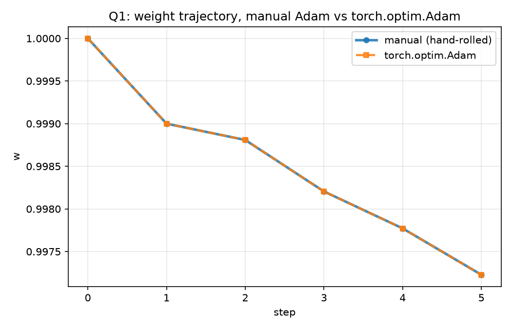

Manual (solid circles) and torch (dashed squares) trace the exact same path
-- both are drawn, and stay visible, only because they use different
line/marker styles.

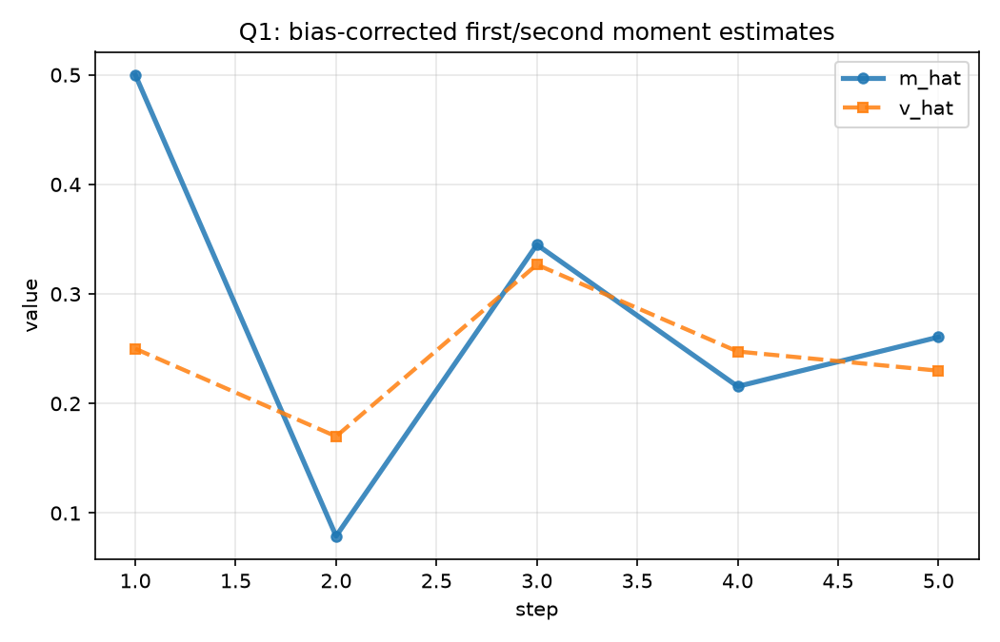

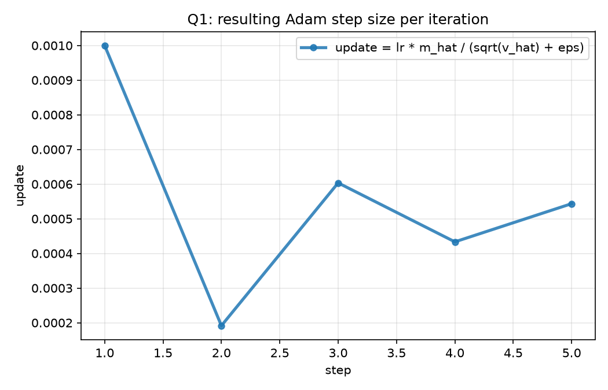

## Q2 -- disable bias correction

File: `q2_bias_correction.py`. Same synthetic weight as Q1, extended to 20
fixed (seeded) gradients, run once with `AdamState(bias_correction=True)`
(real Adam) and once with `bias_correction=False` (m, v used raw).

The exact gap between the two update rules, ignoring `eps`, is closed-form:
`factor(t) = sqrt(1 - beta2^t) / (1 - beta1^t)`, which is what "the difference
stops mattering" ultimately measures (`update_uncorrected = update_corrected /
factor(t)`). Since it's closed-form we aren't limited to only the first 20
steps to answer "when does it stop mattering" -- we compute it out further too.

Run it:
```bash
uv run python experiments/assignment11/q2_bias_correction.py
```

Result: at the requested step 20, `factor(20) = 0.160` -- bias correction is
**still far from irrelevant** at step 20 (the uncorrected update is already
~6.2x larger than the corrected one there, and growing). That's because
`beta2 = 0.999` gives the v-side correction a timescale of `1/(1-beta2) =
1000` steps, much longer than `beta1 = 0.9`'s `1/(1-beta1) = 10`-step
timescale (beta1's own correction term is within 1% by step 44). Extending
the closed-form curve out:

| tolerance on \|factor - 1\| | step reached |
|---|---|
| 10% | 1660 |
| 5% | 2327 |
| 1% | 3916 |

So the honest answer is: **not within the first 20 steps** -- with the
default `beta2=0.999`, bias correction keeps mattering for ~2000-4000 steps,
not 20. A run using a smaller `beta2` (or asking only about `beta1`'s
contribution) would cross that threshold far sooner (~44 steps for beta1
alone).

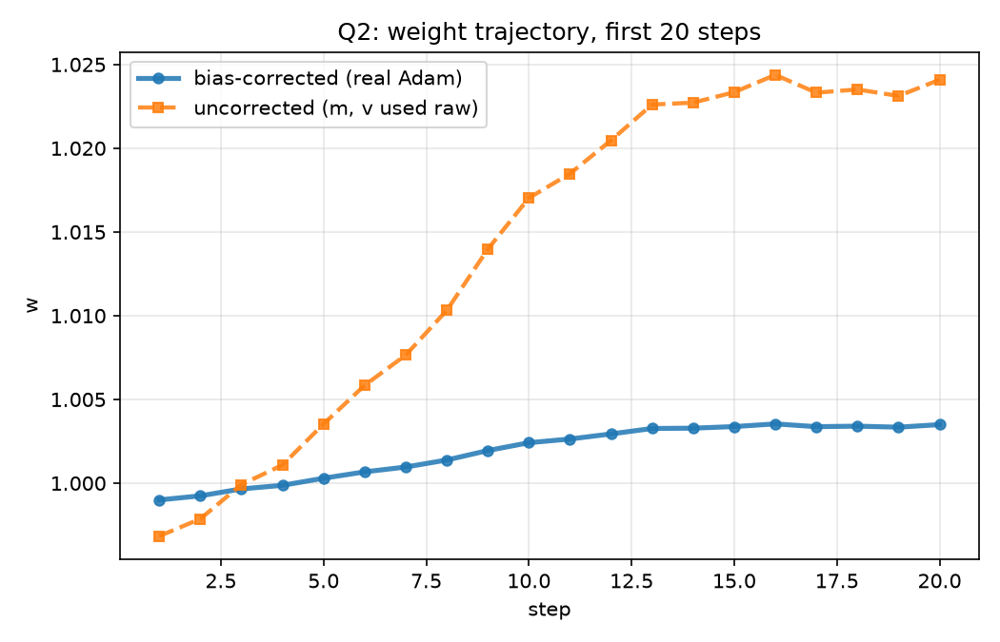

Both trajectories over the requested 20-step window -- visibly diverging,
not converging.

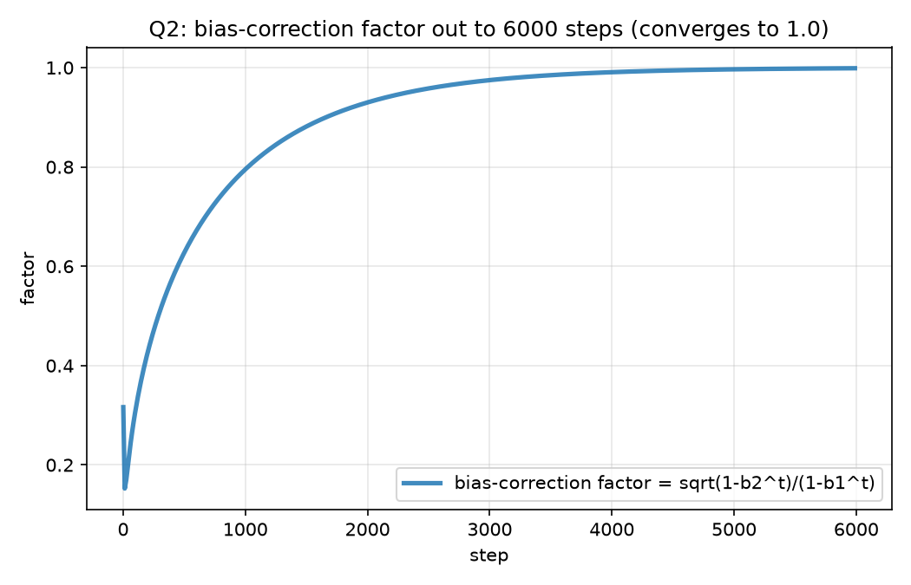

The same factor curve extended out, showing where it actually approaches 1.0.

## Shared infrastructure for Q3-Q5 (real training, not synthetic)

Unlike Q1/Q2, these three questions train the actual `chintana.GPT` (via
`GPT.configure_optimizers`'s real Adam optimizer, the one changed above) on
`data/shakespeare_char`:
- `common.py` -- loads the data, builds a `GPTConfig`/`GPT` from a small
  config, and trains it for a given number of steps under a given LR
  function. Deliberately does not reuse train.py's loop (no
  DDP/checkpointing/wandb) -- just enough to run cheap, instrumented
  experiments on top of the same model and optimizer code train.py uses.
- `schedules.py` -- `cosine_lr` (same shape as train.py's inline schedule)
  and `wsd_lr` (warmup -> stable -> linear decay).

All three questions use the same small architecture so results are
comparable across them: `n_layer=2`, fixed `head_dim=32` (so `n_head` scales
with width), `block_size=64`, `batch_size=16`, `dropout=0`, `bias=False`,
trained from scratch on `shakespeare_char`. This is far smaller than
`config/train_shakespeare_char.yaml`'s default, chosen specifically to keep
each run to well under a minute on this CPU-only machine. Q3 and Q4 both use
width=256 and the learning rate Q5 (below) found to be optimal for that
width (`1e-3`) -- per the assignment's own note, comparing
schedules/diagnostics at a badly-chosen LR isn't a meaningful comparison, so
Q5 was actually run first and its result feeds into Q3/Q4, even though it's
written up last here to keep the questions in order.

## Q3 -- update-to-weight ratio through warmup

File: `q3_update_ratio.py`. Trains width=256 for 400 steps under cosine +
warmup (`warmup_iters=30`, matching train.py's schedule shape via
`schedules.cosine_lr`) at `lr=1e-3`. After every `optimizer.step()`, for six
representative parameter tensors (`wte`/`lm_head`, the first and last
block's `attn.c_attn` and `mlp.c_fc`, and `ln_f`), logs
`||delta_w|| / ||w||` where `delta_w` is the actual parameter change that
step (a clone taken before and after `optimizer.step()`).

Run it:
```bash
uv run python experiments/assignment11/q3_update_ratio.py --lr 1e-3
```

Result: every tracked tensor's ratio rises through warmup, but **peaks after
warmup_iters, not at it** -- e.g. `h.0.attn.c_attn` peaks around step ~90,
`h.1.mlp.c_fc` continues drifting until it plateaus around step 110, well
past the LR schedule's own warmup_iters=30 (see the empirical plateau steps
below, detected as the first step where a 10-step windowed average of the
ratio changes by <1% going forward):

| tensor | empirical plateau step |
|---|---|
| `h.0.attn.c_attn.weight` | 30 |
| `h.0.mlp.c_fc.weight` | 67 |
| `wte.weight` (tied with `lm_head`) | 71 |
| `ln_f.weight` | 74 |
| `h.1.attn.c_attn.weight` | 102 |
| `h.1.mlp.c_fc.weight` | 110 |

So the config's `warmup_iters=30` is not, by itself, "the step at which
warmup stops changing" the update/weight ratio -- only one of the six tracked
tensors plateaus that early. The rest lag by 2-4x warmup_iters. This matches
the expected mechanism: the *LR* schedule finishes ramping at step 30 by
construction, but Adam's own `m`/`v` estimates have their own burn-in
timescale (roughly `1/(1-beta1)` and `1/(1-beta2)` steps, see Q2), so the
ratio keeps evolving after the LR itself has flattened out, and later/larger
tensors (deeper block, larger fan-in) take longer to settle.

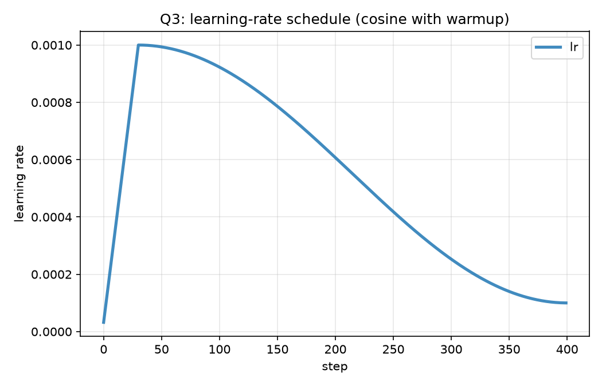

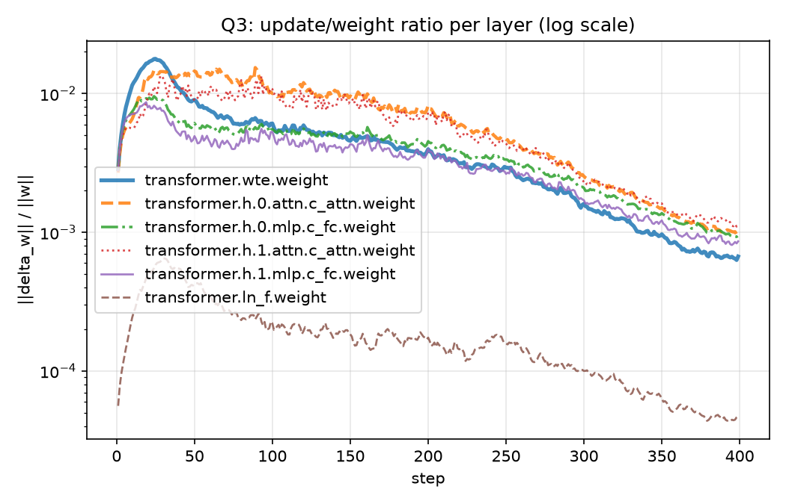

## Q4 -- cosine vs WSD (stop at step 200 of 300)

File: `q4_cosine_vs_wsd.py`. Both schedules are built for a full 300-step
horizon at width=256, `lr=1e-3` (warmup=15 steps; WSD's decay phase is the
last 20%, steps 240-300); both runs share the same seed (same init, same
batch order), so the LR schedule is the only difference. Both are physically
stopped at step 200 -- before either one reaches step 300, and specifically
before WSD's decay phase has even started.

Run it:
```bash
uv run python experiments/assignment11/q4_cosine_vs_wsd.py --lr 1e-3
```

Result (seed 0, the one whose plots/CSV are checked in):

| schedule | lr at step 200 | loss at step 200 (mean of last 10 steps) |
|---|---|---|
| cosine | 3.51e-4 | 2.3583 |
| WSD | 1.00e-3 (still un-decayed) | 2.3562 |

WSD wins, but only by 0.0021 on this one seed -- small enough to want a
robustness check before concluding anything. Re-running with two more seeds
(same architecture/LRs, not checked in as separate artifacts):

| seed | cosine loss | wsd loss | margin |
|---|---|---|---|
| 0 | 2.3583 | 2.3562 | 0.0021 |
| 1 | 2.3534 | 2.3230 | 0.0304 |
| 2 | 2.3323 | 2.2989 | 0.0334 |

WSD wins on all 3 seeds. **I would keep the WSD checkpoint.** The mechanism
is straightforward once you look at the LR curves below: by step 200, cosine
(tuned for a 300-step horizon) has already decayed its LR by about 65%
(`1e-3` -> `3.5e-4`), while WSD's decay phase doesn't start until step 240,
so it has been training at the full peak LR for the entire 200 steps
measured. WSD isn't "better annealed" here -- it just hasn't spent any of
its budget decaying yet, so it has taken more effective optimization steps
by the time you looked. This is exactly the tradeoff WSD is designed around:
if you stop *after* a short decay (say, right at step 200 by adding a
20-step anneal there instead of waiting for step 300), you get to have it
both ways -- but if you stop it cold before any decay at all, you're
comparing "still warming through its stable phase" against a schedule that
already anticipated stopping around there.

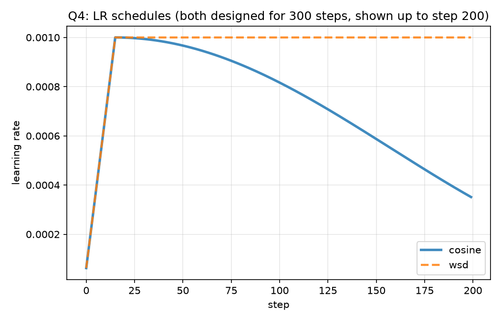

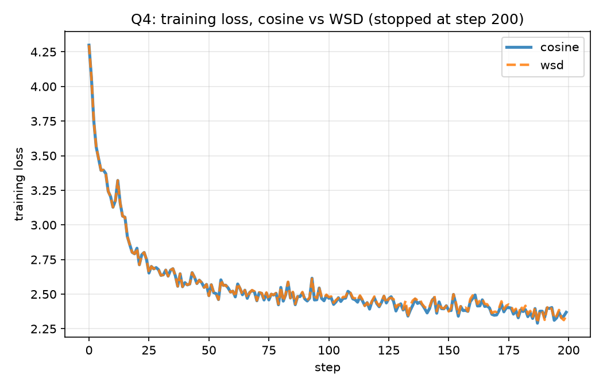

## Q5 -- learning-rate sweep across widths

File: `q5_width_lr_sweep.py`. For widths 256/512/1024 (head_dim fixed at 32,
so `n_head` = 8/16/32), trains from scratch for 150 steps at each of 8
log-spaced constant learning rates (`1e-5` ... `3e-2`, no schedule -- isolates
LR magnitude), and records the mean training loss over the last 10 steps.
Run before Q3/Q4 so its result could feed their peak-LR choice at width=256.

Run it:
```bash
uv run python experiments/assignment11/q5_width_lr_sweep.py
```
(takes on the order of 15-20 minutes on this CPU; see
`results/logs/q5_width_lr_sweep.csv` for the full table.)

Per-width minima (all interior to the grid -- the low end was extended from
an initial narrower grid specifically to confirm width=1024's optimum wasn't
sitting at the edge, per "tune both sides"):

| width | n_head | optimal lr | loss at optimum |
|---|---|---|---|
| 256 | 8 | 1e-3 | 2.4194 |
| 512 | 16 | 3e-4 | 2.4019 |
| 1024 | 32 | 1e-4 | 2.4474 |

`chintana/gpt.py` uses fixed-std (`0.02`) init regardless of width -- standard
parameterization, not muP -- so this leftward shift in optimal LR as width
grows is exactly the expected (and muP's whole reason for existing) behavior,
not noise: each width-doubling here costs roughly a 3x smaller optimal LR.

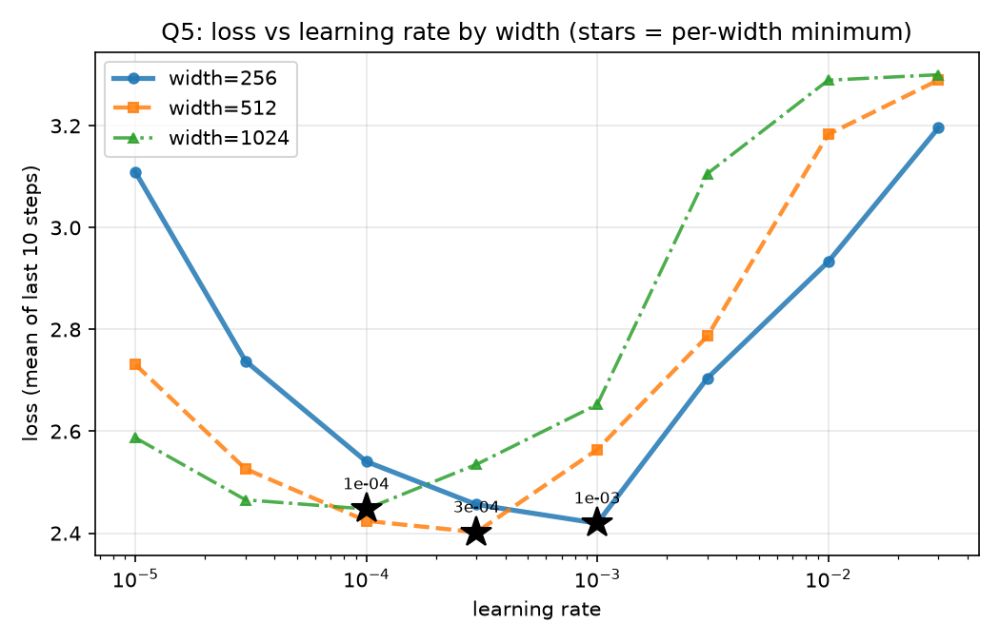

Fitting `log10(lr*) = slope * log10(width) + intercept` in log-log space:
`slope = -1.661`. Extrapolating to width 4096 (4x beyond the largest width
measured):

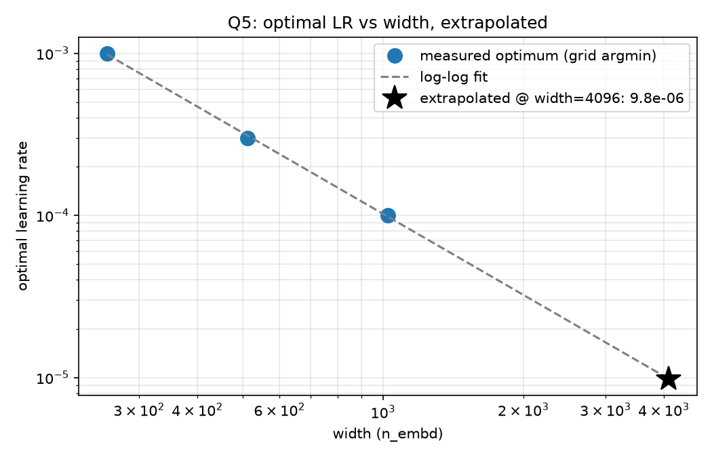

**predicted optimal LR at width 4096: ~1e-5 (9.8e-06)**

Confidence: **low-to-moderate**. Only 3 measured points; standard (non-muP)
init means the relationship isn't guaranteed to stay a clean power law this
far out; loss-after-150-steps is a short-horizon proxy for the actual
converged optimum; and width 4096 is a 4x extrapolation past the largest
width actually measured (roughly 2 more "octaves" of width than the fit was
given). I would treat `~1e-5` as a starting point to verify at width 2048
before trusting it at 4096, not as a number to use directly in a real run.

## "Tune both sides" -- how it was actually applied

- **Q4**: both schedules use the same peak LR, chosen from Q5's result for
  this width rather than picked arbitrarily -- an untuned schedule losing to
  a tuned one wouldn't say anything about cosine vs WSD.
- **Q5**: the LR grid was checked for edge minima after the first pass
  (width=1024 landed on the low edge) and extended downward for all three
  widths until every minimum was interior to the grid -- an edge minimum
  means "the true optimum is unknown," not "the true optimum is here."
- **Q3**: same width and (Q5-tuned) LR as Q4, so the warmup diagnostic isn't
  confounded by also running at a bad LR.
