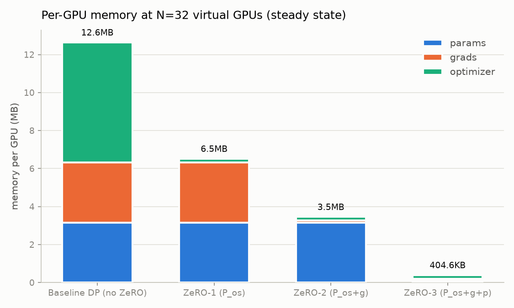
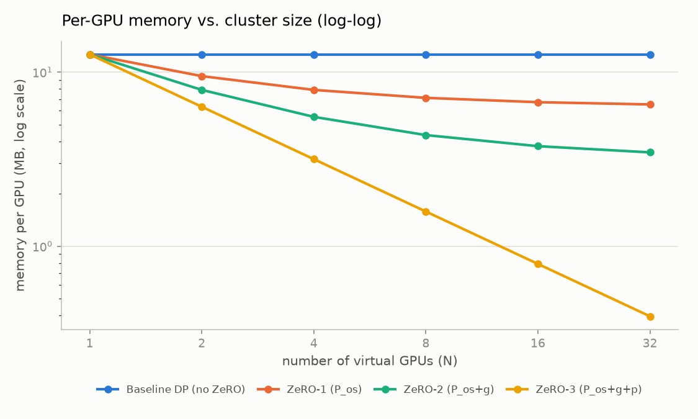
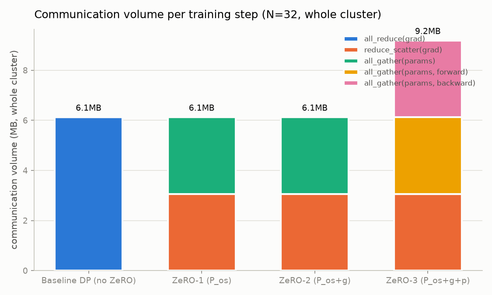
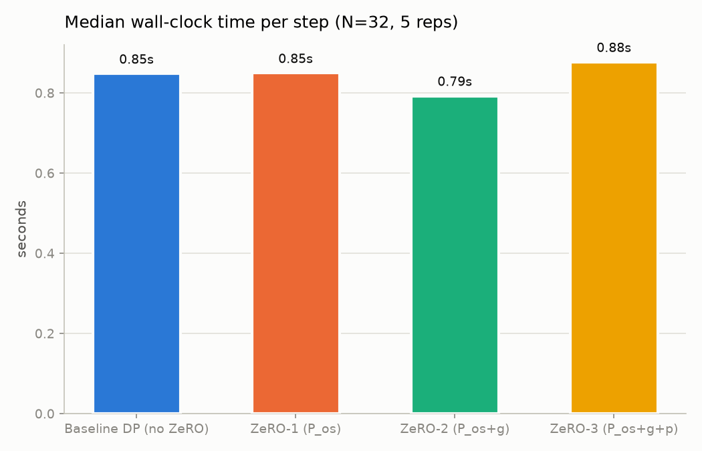

# Assignment 12 -- ZeRO-1/2/3 on 32 virtual GPUs

This directory holds the assignment work on top of Chintana, a modular,
multi-file refactor of [nanoGPT](https://github.com/karpathy/nanoGPT) (see the
repo root `README.md`/`CLAUDE.md` for the base project). Like
`experiments/assignment11`, this directory is entirely additive: nothing here
is imported by `train.py`, `sample.py`, `bench.py`, or `chintana/`, so the base
model and training pipeline are untouched.

The assignment: simulate 32 "virtual GPUs" (CPU threads, since this machine
has no GPU -- see `CLAUDE.md`), build a demo model on top of them, and show how
ZeRO-1, ZeRO-2, and ZeRO-3 each change per-GPU memory and communication for one
training step, relative to plain data parallelism.

## The problem ZeRO solves

Standard data parallelism (DP) replicates the *entire* training state -- model
parameters, gradients, and optimizer state -- onto every GPU, and only
parallelizes the data. For Adam this is wasteful: two GPUs training the same
model hold two bit-for-bit identical copies of every optimizer moment, every
gradient, every parameter, and never use the other copy for anything. ZeRO
(Rajbhandari et al., 2020, ["ZeRO: Memory Optimizations Toward Training
Trillion Parameter Models"](https://arxiv.org/abs/1910.02054)) removes that
redundancy in three cumulative stages, by *partitioning* (sharding) state
across the data-parallel group instead of replicating it, and reconstructing
full tensors on demand via collective communication:

| Stage | Name | What's partitioned | What's still replicated |
|---|---|---|---|
| ZeRO-1 | `P_os` | optimizer state (Adam's `m`, `v`) | parameters, gradients |
| ZeRO-2 | `P_os+g` | optimizer state + gradients | parameters |
| ZeRO-3 | `P_os+g+p` | optimizer state + gradients + parameters | nothing (steady state) |

Each stage trades a little extra communication (ZeRO-3 only) for a large
reduction in per-GPU memory, with the payoff growing as you add more GPUs --
that's the point of testing this at N=32 rather than N=2.

## What "understanding this" means here, concretely

It's easy to quote the paper's memory formula. The point of this simulation is
to show the formula *falls out* of an actual mechanism, not that it was
memorized:

1. **A real model, a real step.** Every stage runs a real forward + backward
   pass of a real `chintana.GPT` (see `common.py`), through real PyTorch
   autograd, on 32 separate model instances (one per virtual GPU) executed
   concurrently via a thread pool (`zero_engine.py`). The memory numbers
   reported are `tensor.numel() * tensor.element_size()` on whatever buffers a
   given stage actually leaves resident on a given GPU -- never a constant
   typed in by hand.
2. **Real collective operations.** `collectives.py` implements `all_reduce`,
   `reduce_scatter`, and `all_gather` as actual tensor math (sum-and-average,
   slice, concatenate) plus a byte-accounting side effect, costed the way a
   ring implementation really moves data: an all-reduce of a P-element buffer
   over N ranks moves `2*(N-1)/N*P` elements *in total across the cluster*;
   a reduce-scatter or an all-gather alone each move half that. This is not
   a simplification for the demo -- it's the actual cost model NCCL/gloo ring
   algorithms use, and it's *why* `all_reduce == reduce_scatter + all_gather`
   turns out to matter (see Q3).
3. **A correctness check, not just a memory count** (Q1). If ZeRO only changes
   *where* state lives, then a 32-GPU ZeRO-3 step must produce the exact same
   updated parameters as a 1-GPU plain step on the same batch. That's checked
   directly, not asserted.

## The demo model and the 32 virtual GPUs

`common.py` builds a small `chintana.GPT` (`n_layer=4, n_head=4, n_embd=128,
block_size=64, vocab_size=256`, byte-level vocabulary so the whole thing is
self-contained -- no `data/` prep step needed) -- about **0.82M parameters**,
picked to be big enough to have a real params/grads/optimizer split worth
plotting, small enough that 32 forward+backward passes finish in under a
second on a laptop CPU. Training data is synthetic random tokens (fixed seed);
this assignment is about memory/communication mechanics, not about training a
model to convergence.

`virtual_gpu.py`'s `VirtualGPU` is the "32 GPUs" of the assignment: each one
owns a private model instance and a `resident` dict of whatever tensors that
GPU currently holds (populated differently per ZeRO stage by `zero_engine.py`).
`make_cluster(n_gpus, ...)` builds `n_gpus` of them, all initialized
identically (as in real DP, every rank starts from the same broadcast init).

**Honest caveat on "32 GPUs":** these are 32 Python threads on one CPU core
pool, not 32 independent accelerators. Python's GIL means the threads don't
get real wall-clock parallelism for Python-level control flow (though PyTorch's
C++ tensor kernels do release the GIL during the actual matmuls, so there's
*some* real overlap) -- see the wall-clock caveat in Q3. The *memory* and
*communication-volume* numbers, by contrast, don't depend on real hardware
parallelism at all -- they're just "how many bytes does this rank hold / move,"
which is exactly what the ZeRO paper's own analysis measures, so those numbers
are the ones that generalize to real multi-GPU clusters.

## Memory model: adapting the paper's formula from fp16 to fp32

The ZeRO paper's headline numbers (`16Ψ` baseline, `4Ψ + 12Ψ/N` for ZeRO-1,
etc.) assume **mixed-precision** training: fp16 parameters and gradients (2
bytes each) plus an fp32 "master copy" of the parameters and two fp32 Adam
moments (`m`, `v`) as the optimizer state (their constant `K=12` = 4 bytes x 3:
master weight + `m` + `v`).

Chintana on CPU doesn't do mixed precision -- `train.py` only enables
`torch.autocast` when `device_type == 'cuda'`; on CPU it runs a plain
`nullcontext()`, i.e. true fp32 throughout. So this simulation adapts the same
partitioning *logic* to fp32-only training, where there's no separate fp32
"master copy" because the working parameters already are fp32:

| Component | Bytes/element | Notes |
|---|---|---|
| parameters | 4 | fp32, no master copy needed |
| gradients | 4 | fp32 |
| optimizer state (`m`, `v`) | 8 | 4 bytes each, Adam's two moments |

Baseline per-GPU memory is `4Ψ + 4Ψ + 8Ψ = 16Ψ` bytes -- the same total as the
paper's mixed-precision number, arrived at from a different (and, for this
codebase, more accurate) breakdown. Carrying the same partitioning logic
through each stage:

| Stage | Formula (bytes/GPU, N ranks) | At N=32, Ψ=828,544 |
|---|---|---|
| Baseline DP | `16Ψ` | 12.6 MB |
| ZeRO-1 | `8Ψ + 8Ψ/N` | 6.5 MB |
| ZeRO-2 | `4Ψ + 12Ψ/N` | 3.5 MB |
| ZeRO-3 (steady state) | `16Ψ/N` | 404.6 KB |

(all MB/KB figures in this README are binary, i.e. `/1024^2`, matching the plots)

These match the measured numbers in `results/logs/q2_memory_breakdown.csv`
exactly (see Q2 below) -- the formula isn't asserted, it's derived from the
same mechanism the simulation actually runs.

## Files

- `common.py` -- builds the demo `GPT`, synthesizes batches, and provides the
  flatten/reshard helpers used everywhere else (a ZeRO implementation
  fundamentally treats "all the model's parameters" as one flat address space
  cut into N equal shards, padding to a multiple of N if needed -- exactly
  what real ZeRO implementations do).
- `virtual_gpu.py` -- the `VirtualGPU` class (one simulated rank) and
  `make_cluster()`.
- `collectives.py` -- `all_reduce_mean`, `reduce_scatter_mean`, `all_gather`:
  real tensor math + real byte-accounting for each collective, plus the
  `CommMeter` that tallies every op's cost.
- `zero_engine.py` -- the core: `run_step(stage, gpus, ref_flat, x, y)` runs
  one training step under `"dp"` / `"zero1"` / `"zero2"` / `"zero3"` and
  returns a `StepResult` (per-GPU memory bytes, communication events,
  wall-clock time, updated parameters, loss). This is where each stage's
  actual sharding mechanics live -- read it alongside the table above.
- `plotting.py` -- shared matplotlib styling and chart builders (stacked
  memory bars, memory-vs-N scaling lines, communication bars, wall-time bars).
- `q1_correctness.py`, `q2_memory_scaling.py`, `q3_communication.py` -- the
  three experiments, each producing a CSV under `results/logs/` and PNG(s)
  under `results/plots/`.

## Running it

```bash
uv run python experiments/assignment12/q1_correctness.py
uv run python experiments/assignment12/q2_memory_scaling.py
uv run python experiments/assignment12/q3_communication.py
```

Each takes a few seconds on this CPU.

## Q1 -- does sharding change the answer?

`q1_correctness.py` runs the same global batch (128 sequences, seed fixed)
through a plain single-device full-batch step, and through each of
dp/zero1/zero2/zero3 split across the same 32 virtual GPUs used everywhere
else in this assignment, and diffs the resulting parameter vectors.

Result (`results/logs/q1_correctness.csv`):

| stage | max\|diff\| vs. single-device |
|---|---|
| dp | 1.553e-05 |
| zero1 | 1.553e-05 |
| zero2 | 1.553e-05 |
| zero3 | 1.553e-05 |

And, cross-checking every stage against every other stage directly
(`results/logs/q1_cross_check.csv`), all six pairs (`dp_vs_zero1`,
`dp_vs_zero2`, ..., `zero2_vs_zero3`) match to `0.000e+00` --
dp/zero1/zero2/zero3 are bit-for-bit identical to one another. They should
be: none of them changes the math, only where state is stored.

The small (~1e-5) gap against the single-device reference is not a bug, and
not ZeRO-specific -- it's float32 non-associativity. Splitting one batch into
N micro-batches changes the order cross-entropy's mean gets computed in (a
mean-of-means over N groups vs. one flat mean over the whole batch), and
floating-point addition isn't associative, so the two orders round differently
in the last few bits. This is exactly why real distributed training uses
identical DP/ZeRO math but can still see run-to-run noise from batch
partitioning -- worth knowing, not worth panicking over.

## Q2 -- memory: per-component breakdown, and scaling with N

`q2_memory_scaling.py` produces two views.

**Per-GPU memory at N=32, broken into params/grads/optimizer**
(`results/logs/q2_memory_breakdown.csv`, `results/plots/q2_memory_breakdown.png`):

| Stage | params | grads | optimizer | **total** |
|---|---|---|---|---|
| Baseline DP | 3.2 MB | 3.2 MB | 6.3 MB | **12.6 MB** |
| ZeRO-1 | 3.2 MB | 3.2 MB | 202.3 KB | **6.5 MB** |
| ZeRO-2 | 3.2 MB | 101.1 KB | 202.3 KB | **3.5 MB** |
| ZeRO-3 (steady state) | 101.1 KB | 101.1 KB | 202.3 KB | **404.6 KB** |



This is exactly the formula table above, evaluated at Ψ=828,544 and N=32 --
each stage's bar shrinks exactly where its name says it should (ZeRO-1 only
shrinks the green "optimizer" segment; ZeRO-2 additionally shrinks orange
"grads"; ZeRO-3 additionally shrinks blue "params"), and the shrinking segment
each time drops to almost exactly `1/32` of its baseline size.

ZeRO-3 also has a **transient peak** above its steady state: this demo
all-gathers the *whole* model's parameters in one shot for forward, frees them,
gathers again for backward, and frees again -- so during backward it
momentarily holds a full gathered parameter buffer *and* a full local gradient
buffer on top of its permanent shards: 404.6 KB steady -> 6.7 MB peak
(`peak_extra_bytes`/`peak_total_bytes` in the CSV). That peak is still nearly
2x smaller than baseline DP's 12.6 MB, but it's a real cost of ZeRO-3 worth
knowing about. Production implementations (e.g. DeepSpeed) gather **layer-by-layer**
and overlap the gather with compute, which keeps the transient bump far
smaller than a full 4Ψ -- this demo's whole-model gather is the simplest
correct thing to implement, and deliberately reports the worst case rather
than hiding it.

**Scaling: per-GPU memory vs. cluster size** (`results/logs/q2_memory_vs_n.csv`,
`results/plots/q2_memory_vs_n.png`), sweeping `N in {1, 2, 4, 8, 16, 32}`:



Baseline DP is flat -- adding GPUs never reduces its per-GPU footprint, which
is the entire motivation for ZeRO. ZeRO-1/2/3 all trend down with more GPUs,
but at different rates because each has a different *fixed* (non-shrinking)
term: ZeRO-1's line flattens out around `8Ψ` (its `4Ψ` params + `4Ψ` grads
floor), ZeRO-2's around `4Ψ` (just its params floor), and ZeRO-3 keeps falling
all the way to `16Ψ/N` because it has no fixed term left to hit a floor
against -- visibly the steepest line on the log-log plot, and the only one of
the three still falling at N=32.

## Q3 -- communication and wall-clock time

`q3_communication.py` measures, at N=32: total bytes moved (summed across the
whole cluster, via `CommMeter`) and median wall-clock time over 5 repeats.

**Communication volume** (`results/logs/q3_communication.csv`,
`results/plots/q3_communication.png`):

| Stage | Total comm/step | Relative to baseline |
|---|---|---|
| Baseline DP | 6.1 MB | 1.00x |
| ZeRO-1 | 6.1 MB | 1.00x |
| ZeRO-2 | 6.1 MB | 1.00x |
| ZeRO-3 | 9.2 MB | **1.50x** |



ZeRO-1 and ZeRO-2 communicate exactly as much as plain DP -- this is the
paper's (initially counterintuitive) result, and the simulation shows *why*:
a standard all-reduce of the gradient is mathematically identical to a
reduce-scatter followed by an all-gather (each moving half of what an
all-reduce moves, and `half + half = whole`). ZeRO-1/2 already need a
reduce-scatter (to compute each rank's local Adam update) and an all-gather
(to re-sync full parameters for the next forward pass) -- they're just
reusing the two halves of what would have been an all-reduce anyway, for a
different purpose than plain DP uses them for. No extra communication is
introduced until parameters themselves get partitioned.

ZeRO-3 is the one stage that costs more: because parameters are also
partitioned, they must be all-gathered twice per step -- once before forward,
once again before backward (they're freed back to shards in between, which is
what makes ZeRO-3's memory saving possible) -- plus the same gradient
reduce-scatter. Three half-sized collective ops instead of two:
`3 x (N-1)/N x Ψ` vs. `2 x (N-1)/N x Ψ`, i.e. exactly **1.5x**, matching the
paper's well-known "ZeRO-3 costs about 50% more communication" claim -- and,
again, this number came out of the simulation's actual op log, not a quoted
constant.

**Wall-clock time** (`results/logs/q3_wall_time.csv`,
`results/plots/q3_wall_time.png`):



| Stage | median wall time |
|---|---|
| Baseline DP | 0.65s |
| ZeRO-1 | 0.69s |
| ZeRO-2 | 0.70s |
| ZeRO-3 | 0.71s |

Times rise slightly from baseline to ZeRO-3, roughly tracking the
communication-volume story -- but this number should be read with real
skepticism, for the reason flagged above: there are no 32 independent
accelerators here, just 32 Python threads timesharing one CPU, so this mostly
reflects thread-pool and simulated-collective overhead rather than anything
that would generalize to real hardware. The *memory* and *communication
volume* results are the ones that transfer to an actual multi-GPU cluster;
wall-clock time on this single-CPU simulation is reported for completeness,
not as a performance claim.

## Summary of what this demonstrates

- ZeRO is a pure memory/communication reshuffle: it never changes the
  optimizer math (Q1 -- all four stages produce bit-for-bit identical
  results).
- Each stage's memory savings come from exactly the mechanism its name
  describes -- `P_os` shrinks only the optimizer-state term, `P_os+g` also
  shrinks gradients, `P_os+g+p` also shrinks parameters -- confirmed by
  measuring actual resident tensor bytes, not by asserting the paper's
  formula (Q2).
- Savings scale with cluster size: ZeRO-3's `16Ψ/N` per-GPU footprint keeps
  falling as N grows, unlike ZeRO-1/2's fixed floors or baseline DP's flat
  line (Q2).
- ZeRO-1/2 are communication-free lunches (same volume as baseline, because
  a reduce-scatter + all-gather *is* an all-reduce); ZeRO-3 trades a real
  50% communication increase for its additional memory savings (Q3) -- the
  central memory-vs-communication tradeoff the ZeRO paper is built around.
